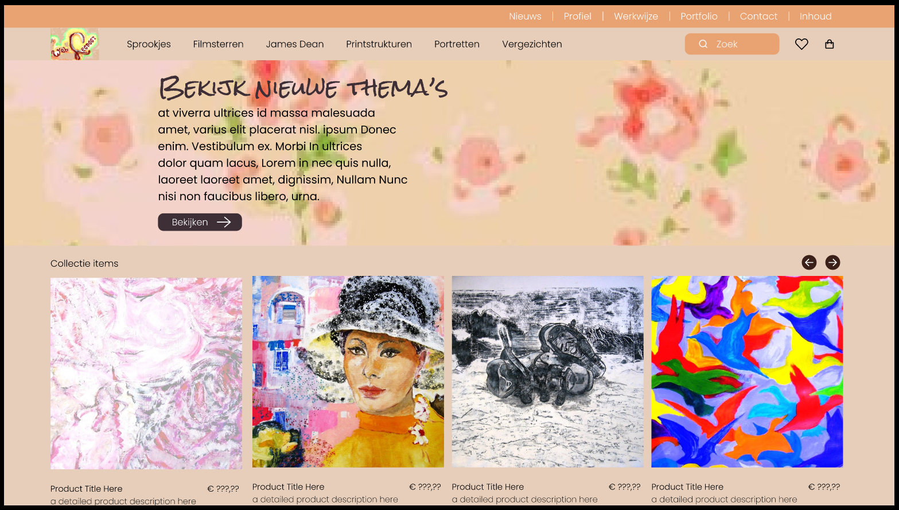

# Getting Started with the React App WebLeonoor

## Inleiding
Deze app geeft een overgezicht van de schilderijen van WebLeonoor.
Persoonlijk ben ik zeer geinteresseerd in tekenen en schilderen en het een en ander in de kast liggen.
Omstreeks 2009 heb ik een webpage gemaakt die dit werk allemaal presenteert.
Deze versie is gemaakt met [Create React App](https://github.com/facebook/create-react-app).

## Applicatie starten

Als je het project gecloned hebt naar jouw locale machine, installeer je eerst de node_modules
door het volgende commando in de terminal te runnen:

## Startpagina
De website begint met hetvolgende scherm.

`npm install`

Wanneer dit klaar is, kun je de applicatie starten met behulp van:

`npm start`

of gebruik de WebStorm knop (npm start). Open [http://localhost:3000](http://localhost:3000) om
de pagina in de browser te bekijken. Begin met het maken van wijzigingen in `src/App.js`:
elke keer als je een bestand opslaat, zullen de wijzigingen te zien zijn op de webpagina.

(English)

In the project directory, you can run:

### `npm start`

Runs the app in the development mode.\
Open [http://localhost:3000](http://localhost:3000) to view it in your browser.

The page will reload when you make changes.\
You may also see any lint errors in the console.

### `npm run build`

Builds the app for production to the `build` folder.\
It correctly bundles React in production mode and optimizes the build for the best performance.

The build is minified and the filenames include the hashes.\
Your app is ready to be deployed!

See the section about [deployment](https://facebook.github.io/create-react-app/docs/deployment) for more information.

